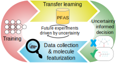

~~~
    ______                  _____   _  _     _____  ______       _____ 
   / \  / \           /\   |_   _| | || |   |  __ \|  ____/\    / ____|
  /   /\   \         /  \    | |   | || |_  | |__) | |__ /  \  | (___  
 /   /  \   \       / /\ \   | |   |__   _| |  ___/|  __/ /\ \  \___ \ 
 \--/----\--/      / ____ \ _| |_     | |   | |    | | / ____ \ ____) | 
  \/______\/      /_/    \_\_____|    |_|   |_|    |_|/_/    \_\_____/   
~~~

# AI for PFAS
</img>

A deep learning expedition into PFAS toxicity. The manuscript can be accessed [here](https://pubs.acs.org/doi/10.1021/acs.jcim.1c01204).

##### Contents
 1. [Brief](#brief)
 1. [Context](#context)
 2. [Dataset](#dataset)
 3. [Installation](#installation)

## Brief
This repository contains code, instructions, and data used in the LDRD deep learning expedition on PFAS toxicity.

##### Repository structure
~~~
ai4pfas/
+-- data/
¦   +-- benchmark-models/
¦   +-- deep-ensemble/
¦   ¦   +-- base-models
¦   ¦   +-- calibration
¦   ¦   +-- transfer-models
¦   +-- latent-space/
¦   +-- preprocessed/
¦   ¦   +-- random
¦   ¦   +-- stratified
¦   +-- selective-net/
¦   +-- transfer-learning/
¦   +-- ldtoxdb-classified.csv
¦   +-- ldtoxdb-mordred.csv
¦   +-- ldtoxdb-raw.csv
¦   +-- pfas8k-classified.csv
¦   +-- pfas8k-mordred.csv
+-- media/
+-- notebooks/
¦   +-- benchmarks/
¦   ¦   +-- benchmarks.ipynb
¦   ¦   +-- tuning-dnn-ecfp.ipynb
¦   ¦   +-- tuning-dnn-mordred.ipynb
¦   ¦   +-- tuning-dnn-mordred-pfas-like-excluded.ipynb
¦   ¦   +-- tuning-nmf.ipynb
¦   ¦   +-- tuning-rf-mordred.ipynb
¦   +-- selective-net.ipynb
¦   +-- transfer-learning.ipynb
¦   +-- uncertainty.ipynb
+-- src/
¦   +-- graphnn/
¦   +-- dataset.py
¦   +-- experimental_setup.py
¦   +-- helpers.py
¦   +-- models.py
¦   +-- preprocess_data.py
+-- LICENSE
+-- README.md
+-- environment.yml
~~~

## Context
 - **Polyfluoroalkyl and perfluoroaklyl** *(PFAS)* - a family of organic industrial synthetics of increasing federal concern for unknown hazards and widespread contamination of DOD & DOE sites
 - **Acute oral rat toxicity** *(LD50)* - a nonspecific quantification of toxicity which measures the minimum 24-hr drug dose to induce 50% lethality in a sample of labratory rats
 - **LDToxDB** - shorthand for the compiled LD50 dataset

## Dataset
LDToxDB was created by compiling LD50 datasets from the [EPA Toxicity Estimation Software Tool (TEST)](https://www.epa.gov/chemical-research/toxicity-estimation-software-tool-test), [NIH Collaborative Acute Toxicity Modeling Suite (CATMoS)](https://ntp.niehs.nih.gov/iccvamreport/2019/technology/comp-tools-dev/catmos/index.html), and National Toxicology Program (NTP). Values represent experimental LD50 measurements in -log(mol/kg). Chemical duplicates were identified by InChIKey and removed.

## Installation
### Requirements
The workflow requires Python 3.7 and relevant packages. Install Anaconda and run the following terminal commands to create an environment based on the repository requirements:
~~~
(base) $ conda create -n ai4pfas -f environment.yml
(base) $ conda activate ai4pfas
~~~

### Running the repo
Start a Jupyter Notebook instance from the terminal and navigate within the UI to execute `.ipynb` files.
~~~
(ai4pfas) $ jupyter notebook
~~~

Python files are directly executable from within the terminal.
~~~
(ai4pfas) $ python ./src/deep-ensemble.py
~~~

### How to cite ?
If you are using the AI4PFAS workflow in your research, please cite us as
```
@article{doi:10.1021/acs.jcim.1c01204,
author = {Feinstein, Jeremy and Sivaraman, Ganesh and Picel, Kurt and Peters, Brian and Vázquez-Mayagoitia, Álvaro and Ramanathan, Arvind and MacDonell, Margaret and Foster, Ian and Yan, Eugene},
title = {Uncertainty-Informed Deep Transfer Learning of Perfluoroalkyl and Polyfluoroalkyl Substance Toxicity},
journal = {Journal of Chemical Information and Modeling},
doi = {10.1021/acs.jcim.1c01204},
note = {PMID: 34905348},
URL = { 
        https://doi.org/10.1021/acs.jcim.1c01204
},
eprint = { 
        https://doi.org/10.1021/acs.jcim.1c01204
}
}
```

## Acknowledgements
This  material  is  based  upon  work  supported  by  Laboratory  Directed  Research  and  Development (LDRD) funding from Argonne National Laboratory, provided by the Director, Office of Science, of the U.S. Department of Energy under Contract No. DE-AC02-06CH11357.
